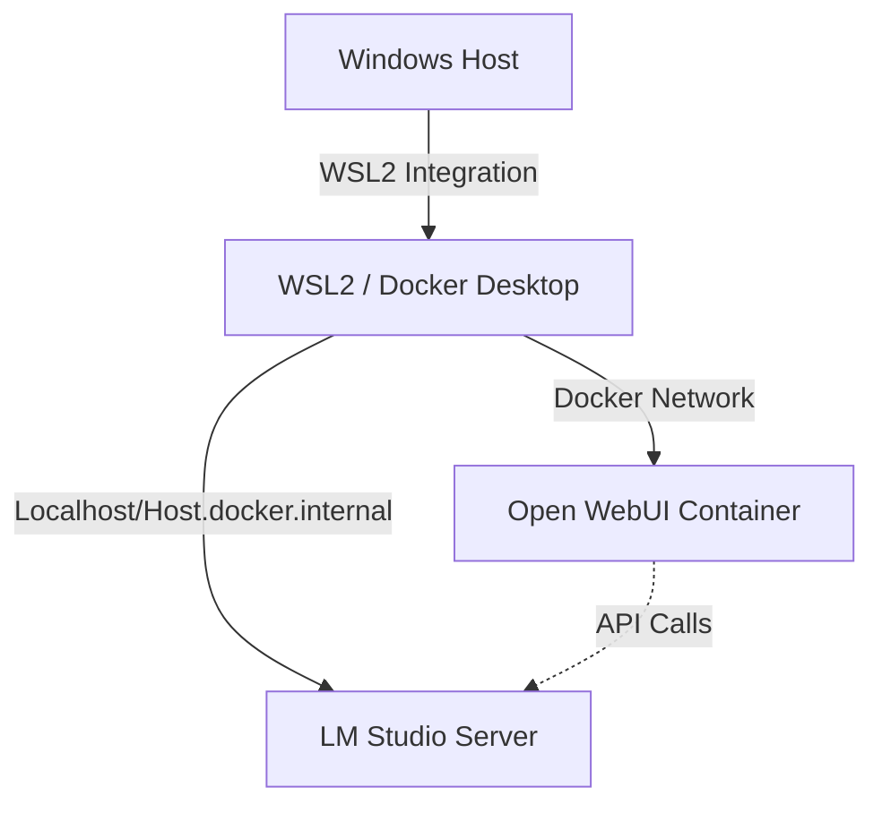

# 🚀 Open WebUI + LM Studio (Local) — Docker on WSL2 (NVIDIA GPU)
**Quick Setup & Troubleshooting Guide**  


## Summary
Step-by-step instructions to run **Open WebUI** in Docker (WSL2 via Docker Desktop) with **NVIDIA GPU support**, and connect it to a locally hosted **LM Studio** model server. Includes minimal `docker-compose` setup, WSL/Windows networking notes, LAN access configuration, and troubleshooting tips.

---

## Table of Contents

- [Architecture Overview](#architecture-overview)
- [Prerequisites](#prerequisites)
- [Configuration & Setup (`docker-compose.yml`)](#configuration-and-setup-docker-composelyml)
- [Start the Stack](#start-the-stack)
- [Run LM Studio (Local Model Server)](#run-lm-studio-local-model-server)
- [Connect Open WebUI to LM Studio](#connect-open-webui-to-lm-studio-two-methods)
- [Expose Open WebUI to Other Devices on Your LAN](#expose-open-webui-to-other-devices-on-your-lan)
- [Troubleshooting](#common-troubleshooting-symptom-based)
- [Quick Commands Cheat Sheet](#quick-commands-cheat-sheet)
- [Security Recommendations](#security-recommendations)

---

## Prerequisites
- ✅ Windows 10/11 with Docker Desktop + WSL2 integration enabled.
- ✅ WSL2 distro (e.g., Ubuntu) with Docker integration enabled in Docker Desktop.
- ✅ NVIDIA GPU with a compatible driver and Docker Desktop GPU support enabled.
- ✅ LM Studio installed and running locally (local model server/API).
- ✅ Basic familiarity with PowerShell and editing files.

---

## Architecture Overview


---

## Files to Create
- `docker-compose.yml` — Open WebUI container (CUDA image).
- *(Optional)* PowerShell script for firewall/port checks.

---

## 1. Configuration (`docker-compose.yml`)

Map host port **8082** → container port **8080**. Use the CUDA image to enable GPU support.

```yaml
version: "3.8"
services:
  openwebui:
    image: ghcr.io/open-webui/open-webui:cuda
    container_name: openwebui
    ports:
      - "8082:8080"
    volumes:
      - open-webui:/app/backend/data
    environment:
      - NVIDIA_VISIBLE_DEVICES=all
    # Simple compose GPU setting (works with Compose v2 + nvidia-container-toolkit)
    gpus: all
    # Optional: explicit device reservation for Docker engines that require it
    deploy:
      resources:
        reservations:
          devices:
            - driver: nvidia
              count: all
              capabilities: [gpu]

volumes:
  open-webui:
```

### Configuration Notes
- **Image Tag:** Use `:cuda` to include CUDA support. Use `-slim` variants if you want smaller images that download models later.
- **Port Mapping:** Change the host port (first number) if `8082` conflicts with other services on your network.
- **GPU Setup:** Your config uses both Compose v2 `gpus: all` and explicit Docker engine reservations (`deploy.resources`). This is a robust setup that ensures GPU allocation works across different Docker versions and WSL2 environments.

---

## 2. Start the Stack

1. In your project directory, run:
   ```bash
   docker compose up -d
   ```
2. Verify the container is running and GPU accessible:
   ```bash
   docker compose ps
   docker exec -it openwebui nvidia-smi
   ```

---

## 3. Run LM Studio (Local Model Server)

1. Start LM Studio and enable its HTTP/REST server.
2. Note the host/port it uses for the API (e.g., `http://127.0.0.1:11434` or similar).
3. Confirm the endpoint responds:
   ```bash
   curl http://127.0.0.1:<LM_PORT>/health
   ```

---

## 4. Connect Open WebUI to LM Studio

### Method A — In-app Configuration (Preferred)
If Open WebUI supports external model backends:
1. Open Open WebUI in your browser from the host: `http://localhost:8082`
2. Navigate to **Models** → **Remote Models** (or Settings).
3. Add a custom model with the LM Studio HTTP API base URL.
   - Use `http://host.docker.internal:<LM_PORT>` or `http://127.0.0.1:<LM_PORT>`.
4. *Tip:* Use `host.docker.internal` when connecting from a container to the Windows host; Docker Desktop resolves this name automatically.

### Method B — Reverse Proxy (Fallback)
If direct configuration isn't available, run a lightweight proxy on the Windows host forwarding paths to LM Studio, or configure container DNS to reach `host.docker.internal`.

### 📡 Important Container Networking Notes
- **From inside the container**, access Windows-host services via `host.docker.internal`.
- If LM Studio runs in WSL, the container may reach it via `localhost` or internal network. Test from inside the container:
  ```bash
  docker exec -it openwebui curl -sS http://host.docker.internal:<LM_PORT>/
  ```

---

## 5. Expose Open WebUI to LAN Devices

To allow other devices on your local network to access Open WebUI:

1. Ensure `docker-compose` maps a host port (e.g., `8082`).
2. On Windows, allow the port through the firewall (Admin PowerShell):
   ```powershell
   New-NetFirewallRule -DisplayName "OpenWebUI 8082" -Direction Inbound -Action Allow -Protocol TCP -LocalPort 8082 -Profile Any
   ```
3. Ensure Windows network is set to **Private** (Settings → Network & Internet).
4. Access from another device: `http://<WINDOWS_LAN_IP>:8082`

> **Tip:** Brave and some browsers may automatically upgrade to HTTPS for IP endpoints — use explicit `http://` to avoid that behavior.

---

## 🛠 Common Troubleshooting (Symptom-Based)

### Service works locally but not from other device
- ✅ Confirm `docker compose ps` shows `0.0.0.0:HOSTPORT->CONTAINERPORT`.
- ✅ Confirm Windows firewall rule exists and profiles include the active network.
- ✅ Confirm Windows network is set to **Private**.
- 🚀 **Ping fails?** Enable ICMP inbound:
  ```powershell
  New-NetFirewallRule -Name "Allow-ICMPv4-In" -Protocol ICMPv4 -IcmpType 8 -Action Allow -Direction Inbound -Profile Any
  ```
- 🔒 Check router/AP for client isolation or guest network restrictions.

### Service visible on Windows localhost but not on LAN IP
- Test from PowerShell: `curl http://localhost:8082` vs `curl http://<LAN_IP>:8082`.
- If the second fails, firewall/AV or network profile is blocking; set rule profile to **Any**:
  ```powershell
  Set-NetFirewallRule -DisplayName "" -Profile Any
  ```

### Container not seeing GPU / `nvidia-smi` fails
- ✅ Ensure NVIDIA driver on Windows is installed and Docker Desktop GPU support enabled.
- 🔍 Inside container: `docker exec -it openwebui nvidia-smi`.
- ⚙️ If it fails, check **Docker Desktop > Settings > Resources > GPU** and WSL integration; restart Docker Desktop.

### Open WebUI cannot reach LM Studio
- 🧪 From container, test using curl:
  ```bash
  docker exec -it openwebui curl -v http://host.docker.internal:<LM_PORT>/health
  ```
- If `host.docker.internal` fails, try using the Windows host IP instead, or run LM Studio inside WSL so container networking is local.

### Browser auto-upgrades to HTTPS / blocked content
- 🌐 Use `http://` explicitly.
- 🔒 For a secure setup, terminate TLS with a reverse proxy (Caddy, Nginx) and use a valid certificate.

---

## Appendix — Quick Commands Cheat Sheet

| Action | Command |
| :--- | :--- |
| **Start services** | `docker compose up -d` |
| **Show status** | `docker compose ps` |
| **Tail logs** | `docker compose logs -f openwebui` |
| **Check GPU in container** | `docker exec -it openwebui nvidia-smi` |
| **Add firewall rule** | `New-NetFirewallRule -DisplayName "OpenWebUI 8082" ...` |
| **Set network to Private** | `Set-NetConnectionProfile -InterfaceAlias "" -NetworkCategory Private` |

---

## 🔒 Security Recommendations
- ⚠️ Don't expose Open WebUI to the public internet without authentication and TLS.
- 🛡 Use a reverse proxy with TLS and HTTP auth, or run behind a VPN for remote access.